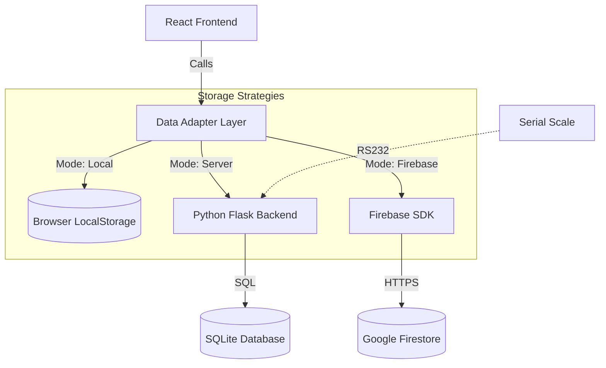

# MarketOS Pro 🛒


---

## What is MarketOS

**MarketOS** is a high-performance, hybrid Point of Sale (POS) and Enterprise Resource Planning (ERP) system designed for modern retail. It combines the speed of a desktop application with the flexibility of cloud synchronization.

Unlike traditional web-based POS systems, MarketOS runs **locally** (offline-first) using a Python/Flask backend, ensuring zero latency during checkout, while optionally syncing data to **Google Firebase** for remote management.

---

## Key Features

### Point of Sale (POS)
- **Touch-Optimized Interface**: Fast checkout flow with cart management.
- **Hardware Integration**: Native support for **Serial Scales (RS232)** and Barcode Scanners.
- **Smart Search**: Instant product lookup by name or barcode.

### Advanced Warehouse (WMS)
- **Batch Management**: Track products by **Lot/Batch**, **Expiry Date**, and **Supplier**.
- **FIFO/FEFO Logic**: Automatic stock deduction based on First-Expired-First-Out logic.
- **Stock Alerts**: Real-time notifications for low stock or expiring items.
- **Label Printing**: Generate barcode labels (Code128) and shelf tags directly from the app.

### Debt Register
- **Customer Accounting**: Track debts, payments, and balances.
- **Document Management**: Upload and store **PDFs/Images** (invoices, ID cards) linked to customer profiles.
- **Dual View**: Switch between Accounting view (transactions) and Documents view.

### AI Assistant (MarketBrain)
- **Natural Language Processing**: Ask questions like *"How many apples did I sell yesterday?"* or *"Show me expiring products"*.
- **Financial Analytics**: Real-time calculation of Revenue, Net Profit, and VAT.
- **Interactive Charts**: Visual trends for sales and profits.

---

## Technical Architecture

MarketOS is built on a **Hybrid Core** architecture. Here is a breakdown of the key subsystems:

### 1. System Architecture & Data Flow
The application relies on a unified **Data Adapter** pattern that abstracts the underlying storage mechanism. This allows the frontend to remain agnostic of where data is stored.



### 2. The "MarketBrain" NLP Engine
We developed a custom, rule-based NLP engine (`MarketBrain`) running entirely in the browser (Client-Side).
- **Privacy First**: No data is sent to external AI APIs (like OpenAI).
- **Logic**:
    1.  **Normalization**: Cleans input strings (lowercasing, punctuation removal).
    2.  **Entity Extraction**: Identifies *Time Entities* ("today", "last week") and *Product Entities* (fuzzy matching against inventory).
    3.  **Intent Classification**: Uses keyword density to determine if the user wants *Stock Info*, *Sales Analysis*, or *Expiry Reports*.
    4.  **Data Aggregation**: Dynamically filters the transaction log (`logs`) based on the extracted entities to generate natural language responses.

### 3. Hybrid Data Adapter Pattern
The application uses a unified `DataAdapter` interface that abstracts the storage layer.
- **Modes**:
    - `Local`: Uses browser `localStorage` (Demo mode).
    - `Server`: Communicates with the Python Flask backend (`sqlite3`).
    - `Firebase`: Direct connection to Firestore/Storage via JS SDK.
- **Benefit**: The UI code remains agnostic to the storage backend. Switching from Local to Cloud is a single config toggle.

### 4. Warehouse Logic (FIFO/FEFO)
Inventory management uses a sophisticated algorithm to handle stock deduction:
- **Batches**: Every product stock is split into batches with specific expiry dates and costs.
- **FEFO (First Expired, First Out)**: When a sale occurs, the system automatically deducts stock from the batch with the nearest expiry date.
- **Cost Averaging**: The system tracks the specific cost of each batch to calculate precise profit margins on sales.

### 5. POS Transaction Engine
The checkout process is atomic:
1.  **Calculation**: Computes Totals, VAT (based on product tax rate), and Net Revenue.
2.  **Stock Deduction**: Triggers the FEFO algorithm to update batch quantities.
3.  **Logging**: Saves an immutable transaction log (`logs`) and updates the daily financial stats.

### 6. Hardware Bridge (Python <-> JS)
To access hardware like Serial Scales which browsers cannot access directly:
- **Python Layer**: Uses `pyserial` to read raw bytes from COM ports.
- **Flask API**: Exposes endpoints (e.g., `/api/scale/read`).
- **React Frontend**: Polls the local API to update the UI in real-time.

---

## Installation

### For End Users
1. Download the latest installer **MarketOS_Setup_v15.0.exe** from the Releases Page.
2. Run the setup wizard.
3. Launch **MarketOS Pro** from your desktop.

### For Developers

```bash
git clone https://github.com/SinghProbjot/MarketOS.git
cd MarketOS

pip install -r requirements.txt
